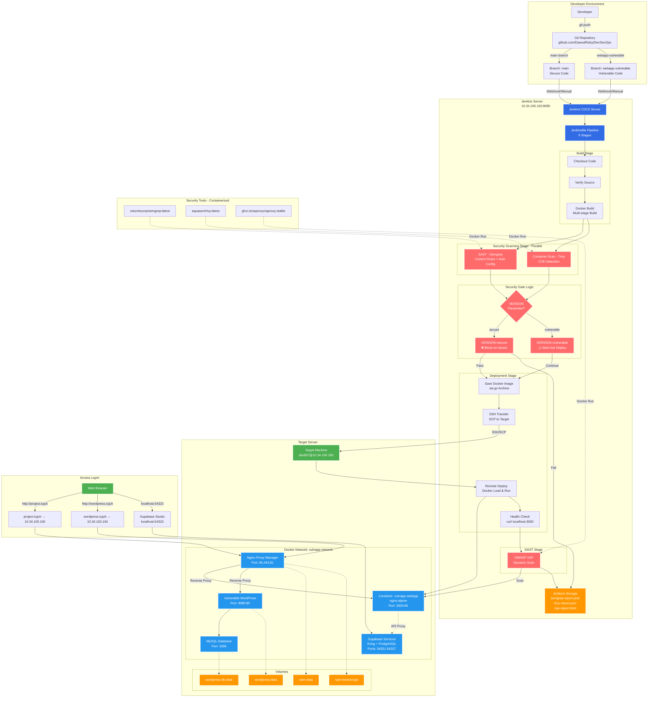
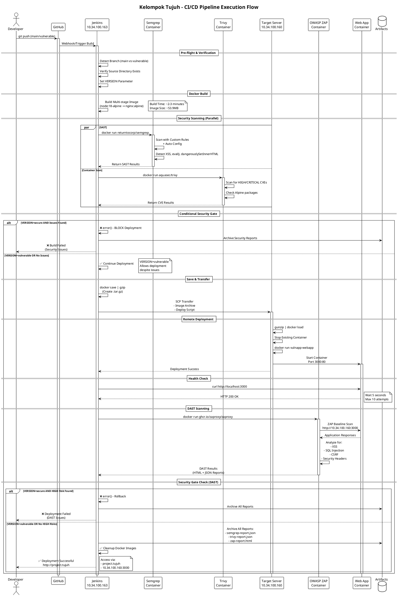
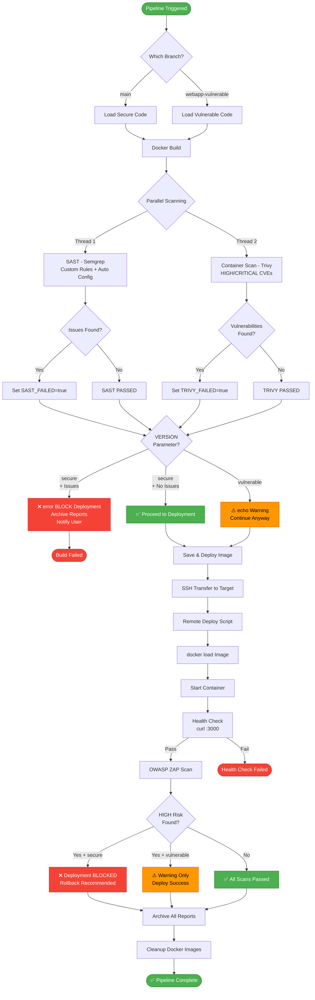
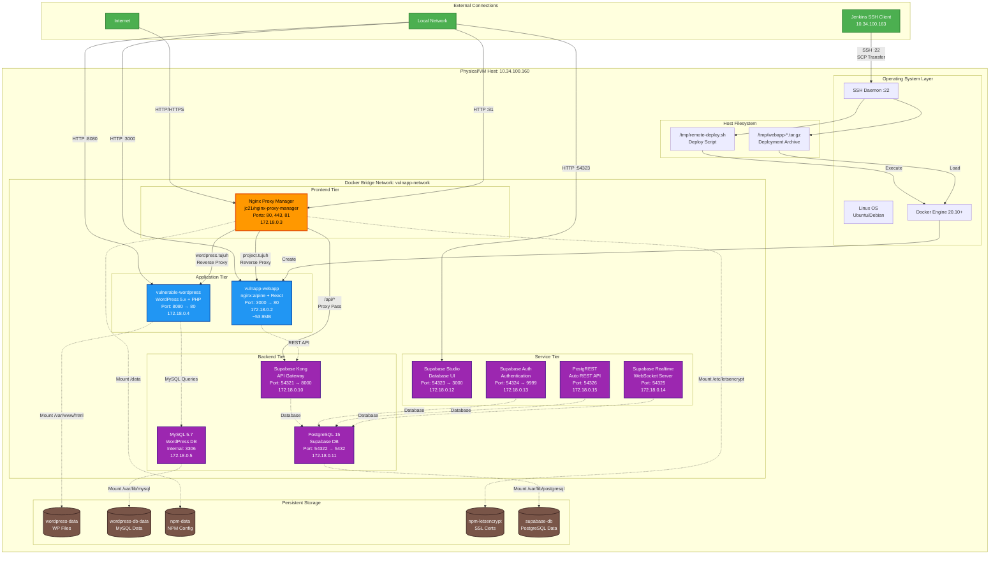
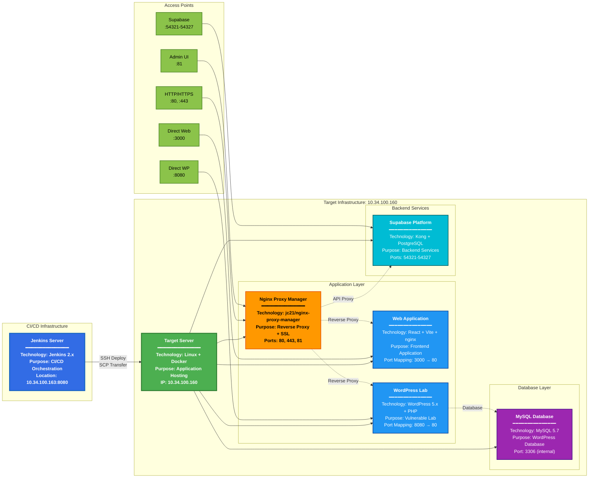

# Kelompok Tujuh - CI/CD Architecture Diagram

## Architecture Overview

This document provides visual representations of the complete DevSecOps CI/CD pipeline architecture for Kelompok Tujuh project.

---

## Mermaid Diagram

### Complete CI/CD Pipeline Architecture



---

## PlantUML Diagram

### Complete System Architecture

```plantuml
@startuml Kelompok_Tujuh_Architecture
!define ICONURL https://raw.githubusercontent.com/tupadr3/plantuml-icon-font-sprites/v2.4.0
!include ICONURL/common.puml
!include ICONURL/font-awesome-5/git_alt.puml
!include ICONURL/font-awesome-5/docker.puml
!include ICONURL/font-awesome-5/server.puml
!include ICONURL/font-awesome-5/user.puml

skinparam backgroundColor #FFFFFF
skinparam componentStyle rectangle

title Kelompok Tujuh - DevSecOps CI/CD Architecture

actor Developer as dev
cloud "GitHub" as github {
    component "DevSecOps Repo" as repo {
        [main branch\n(Secure Code)] as main
        [webapp-vulnerable\n(Vulnerable Code)] as vuln
        [Jenkinsfile\n(587 lines)] as jenkinsfile
        [custom-rules.yaml\n(Semgrep Rules)] as rules
    }
}

node "Jenkins Server\n10.34.100.163:8080" as jenkins {
    rectangle "CI/CD Pipeline" as pipeline {
        rectangle "Stage 1-2: Pre-flight & Verify" as stage1 {
            [Branch Detection]
            [Source Verification]
            [Environment Setup]
        }
        
        rectangle "Stage 3: Build" as stage2 {
            [Docker Build\nMulti-stage] as build
            [node:18-alpine\n↓\nnginx:alpine] as multistage
        }
        
        rectangle "Stage 4: Security Scanning (Parallel)" as stage3 {
            component "SAST" as sast {
                [Semgrep\nCustom Rules\n+ Auto Config] as semgrep
                [returntocorp/semgrep] as semgrep_img
            }
            component "Container Scan" as cscan {
                [Trivy\nHIGH/CRITICAL\nCVE Detection] as trivy
                [aquasec/trivy:latest] as trivy_img
            }
        }
        
        rectangle "Security Gate Logic" as gate {
            decision "VERSION?" as version_check
            [VERSION=secure\n❌ Block on Issues] as secure_gate
            [VERSION=vulnerable\n⚠️ Warn but Deploy] as vuln_gate
        }
        
        rectangle "Stage 5-8: Deploy" as stage4 {
            [Save Image\n.tar.gz] as save
            [SSH Transfer\nSCP] as transfer
            [Remote Deploy\nDocker Load] as deploy
            [Health Check\ncurl :3000] as health
        }
        
        rectangle "Stage 9: DAST" as stage5 {
            [OWASP ZAP\nBaseline Scan] as zap
            [ghcr.io/zaproxy/\nzaproxy:stable] as zap_img
        }
        
        database "Artifacts" as artifacts {
            file "semgrep-report.json"
            file "trivy-report.json"
            file "zap-report.html"
            file "zap-report.json"
        }
    }
}

node "Target Server\n10.34.100.160" as target {
    rectangle "Docker Network\nvulnapp-network" as network {
        component "Web Application" as webapp {
            [vulnapp-webapp\nnginx:alpine\n:3000→:80] as app
        }
        
        component "Nginx Proxy Manager" as npm {
            [NPM Container\n:80,:443,:81] as npm_service
            [Admin UI\n:81] as npm_admin
        }
        
        component "WordPress Lab" as wp {
            [vulnerable-wordpress\n:8080→:80] as wordpress
            [MySQL 5.7\n:3306] as mysql
        }
        
        component "Supabase Services" as supabase {
            [Kong Gateway\n:54321] as kong
            [PostgreSQL\n:54322] as postgres
            [Supabase Studio\n:54323] as studio
            [Auth Server\n:54324] as auth
        }
    }
    
    database "Docker Volumes" as volumes {
        storage "wordpress-data"
        storage "wordpress-db-data"
        storage "npm-data"
        storage "npm-letsencrypt"
    }
}

actor "End User" as user
cloud "DNS Resolution" as dns {
    [/etc/hosts] as hosts
    [project.tujuh\n→ 10.34.100.160] as dns1
    [wordpress.tujuh\n→ 10.34.100.160] as dns2
}

' Developer Flow
dev --> github : git push
main --> jenkinsfile
vuln --> jenkinsfile

' CI/CD Flow
github --> jenkins : Webhook/Manual
jenkinsfile --> stage1
stage1 --> stage2
stage2 --> build
build --> multistage

' Security Scanning
build --> semgrep
build --> trivy
semgrep_img ..> semgrep : Docker Run
trivy_img ..> trivy : Docker Run
rules ..> semgrep : Mount

semgrep --> version_check
trivy --> version_check
version_check --> secure_gate : secure
version_check --> vuln_gate : vulnerable

' Conditional Flow
secure_gate --> save : ✅ Pass
secure_gate --> artifacts : ❌ Fail (Block)
vuln_gate --> save : ⚠️ Always Continue

' Deployment Flow
save --> transfer
transfer --> deploy : SSH/SCP
deploy --> target
deploy --> app
deploy --> health

' DAST Flow
health --> zap
zap --> app : Scan http://10.34.100.160:3000
zap_img ..> zap : Docker Run
zap --> artifacts

' Target Server Connections
app --> kong : API Proxy
wordpress --> mysql
npm_service --> app : Reverse Proxy
npm_service --> wordpress : Reverse Proxy

' Volume Mounts
wordpress ..> volumes
mysql ..> volumes
npm_service ..> volumes

' User Access
user --> dns
dns --> npm_service : HTTP/HTTPS
user --> studio : localhost:54323
user --> npm_admin : localhost:81

' Styling
skinparam component {
    BackgroundColor<<security>> #FF6B6B
    BorderColor<<security>> #C92A2A
    BackgroundColor<<docker>> #2496ED
    BorderColor<<docker>> #0078D4
    BackgroundColor<<jenkins>> #326CE5
    BorderColor<<jenkins>> #1B4F8C
}

stage3 <<security>>
gate <<security>>
webapp <<docker>>
npm <<docker>>
wp <<docker>>
supabase <<docker>>
pipeline <<jenkins>>

@enduml
```

---

## Deployment Flow Sequence

### PlantUML Sequence Diagram



---

## Network Architecture Diagram

### Mermaid Network Topology

```mermaid
graph TB
    subgraph "External Access"
        USER[End User Browser]
        ADMIN[DevOps Admin]
    end

    subgraph "Jenkins Server: 10.34.100.163"
        JENKINS_SVC[Jenkins Service :8080]
        DOCKER_BUILD[Docker Build Environment]
        SSH_CLIENT[SSH Client]
    end

    subgraph "Target Server: 10.34.100.160"
        subgraph "Host Network"
            PORT80[Host Port :80]
            PORT81[Host Port :81]
            PORT443[Host Port :443]
            PORT3000[Host Port :3000]
            PORT8080[Host Port :8080]
            PORTS_SUPA[Host Ports :54321-54327]
        end

        subgraph "Docker Network: vulnapp-network (172.18.0.0/16)"
            subgraph "Application Layer"
                NPM_CONT["Nginx Proxy Manager<br/>172.18.0.3<br/>Internal: 80,443,81"]
                WEBAPP_CONT["vulnapp-webapp<br/>172.18.0.2<br/>Internal: 80"]
            end

            subgraph "WordPress Lab"
                WP_CONT["vulnerable-wordpress<br/>172.18.0.4<br/>Internal: 80"]
                MYSQL_CONT["wordpress-mysql<br/>172.18.0.5<br/>Internal: 3306"]
            end

            subgraph "Supabase Services"
                KONG_CONT["supabase_kong<br/>172.18.0.10<br/>Internal: 8000"]
                PG_CONT["supabase_db<br/>172.18.0.11<br/>Internal: 5432"]
                STUDIO_CONT["supabase_studio<br/>172.18.0.12<br/>Internal: 3000"]
                AUTH_CONT["supabase_auth<br/>172.18.0.13<br/>Internal: 9999"]
            end
        end

        subgraph "Docker Volumes"
            VOL_WP[wordpress-data]
            VOL_MYSQL[wordpress-db-data]
            VOL_NPM[npm-data]
            VOL_SSL[npm-letsencrypt]
        end
    end

    subgraph "DNS Resolution"
        HOSTS[/etc/hosts<br/>project.tujuh → 10.34.100.160<br/>wordpress.tujuh → 10.34.100.160]
    end

    %% User Access Flow
    USER -->|DNS Lookup| HOSTS
    HOSTS -->|Resolve IP| PORT80
    PORT80 --> NPM_CONT
    
    USER -->|Direct Access| PORT3000
    PORT3000 --> WEBAPP_CONT

    USER -->|Direct Access| PORT8080
    PORT8080 --> WP_CONT

    USER -->|Supabase Studio| PORTS_SUPA
    PORTS_SUPA --> STUDIO_CONT

    %% Admin Access
    ADMIN -->|Web UI :81| PORT81
    PORT81 --> NPM_CONT

    ADMIN -->|CI/CD Trigger| JENKINS_SVC

    %% Jenkins Deployment Flow
    JENKINS_SVC --> DOCKER_BUILD
    DOCKER_BUILD --> SSH_CLIENT
    SSH_CLIENT -->|SSH :22<br/>SCP Transfer| PORT80

    %% NPM Reverse Proxy
    NPM_CONT -->|project.tujuh| WEBAPP_CONT
    NPM_CONT -->|wordpress.tujuh| WP_CONT
    NPM_CONT -->|/api/* proxy| KONG_CONT

    %% Application Connections
    WEBAPP_CONT -.->|API Calls| KONG_CONT
    WP_CONT -.->|Database| MYSQL_CONT
    KONG_CONT -.->|Database| PG_CONT
    AUTH_CONT -.->|Database| PG_CONT

    %% Volume Mounts
    WP_CONT -.->|Mount| VOL_WP
    MYSQL_CONT -.->|Mount| VOL_MYSQL
    NPM_CONT -.->|Mount| VOL_NPM
    NPM_CONT -.->|Mount| VOL_SSL

    %% Styling
    classDef external fill:#81C784,stroke:#388E3C,stroke-width:2px,color:#000
    classDef jenkins fill:#326CE5,stroke:#1565C0,stroke-width:2px,color:#fff
    classDef proxy fill:#FF9800,stroke:#E65100,stroke-width:2px,color:#000
    classDef app fill:#2196F3,stroke:#0D47A1,stroke-width:2px,color:#fff
    classDef db fill:#9C27B0,stroke:#4A148C,stroke-width:2px,color:#fff
    classDef storage fill:#795548,stroke:#3E2723,stroke-width:2px,color:#fff

    class USER,ADMIN external
    class JENKINS_SVC,DOCKER_BUILD,SSH_CLIENT jenkins
    class NPM_CONT proxy
    class WEBAPP_CONT,WP_CONT,KONG_CONT,STUDIO_CONT,AUTH_CONT app
    class MYSQL_CONT,PG_CONT db
    class VOL_WP,VOL_MYSQL,VOL_NPM,VOL_SSL storage
```

---

## Component Interaction Diagram

### PlantUML Component Diagram

```plantuml
@startuml Component_Diagram
!theme plain

title Kelompok Tujuh - Component Interactions

package "Development Environment" {
    [Developer Workstation] as DEV
    [Git Client] as GIT_CLI
}

package "Source Control" {
    [GitHub Repository] as GITHUB
    database "Branches" {
        [main\n(Secure)] as MAIN
        [webapp-vulnerable\n(Vulnerable)] as VULN
    }
    file "Jenkinsfile" as JENKINSFILE
    file "custom-rules.yaml" as RULES
}

package "Jenkins Server - 10.34.100.163:8080" {
    [Jenkins Master] as JENKINS_M
    
    package "Pipeline Stages" {
        [Pre-flight Check] as PREFLIGHT
        [Source Verification] as VERIFY
        [Docker Build] as BUILD
        [Security Scanning] as SECURITY
        [Save & Transfer] as TRANSFER
        [Remote Deploy] as DEPLOY
        [Health Check] as HEALTH
        [DAST] as DAST
    }
    
    package "Security Tools" {
        component "Semgrep" {
            [Custom Rules Engine] as SEMGREP_CUSTOM
            [Auto Config] as SEMGREP_AUTO
        }
        component "Trivy Scanner" as TRIVY
        component "OWASP ZAP" as ZAP
    }
    
    database "Jenkins Artifacts" {
        file "semgrep-report.json"
        file "trivy-report.json"
        file "zap-report.html"
        file "Docker Images"
    }
    
    [SSH Client] as SSH
}

package "Target Server - 10.34.100.160" {
    [Docker Engine] as DOCKER_ENGINE
    [SSH Daemon] as SSHD
    
    package "Docker Network: vulnapp-network" {
        component "Web Application" {
            [vulnapp-webapp\nReact/Vite + nginx] as WEBAPP
            [Environment Config] as ENV
        }
        
        component "Nginx Proxy Manager" {
            [NPM Admin UI] as NPM_ADMIN
            [Reverse Proxy] as NPM_PROXY
            [SSL Manager] as NPM_SSL
        }
        
        component "WordPress Lab" {
            [WordPress Core] as WP_CORE
            [Vulnerable Plugins] as WP_PLUGINS
            [PHP Runtime] as PHP
        }
        
        component "Supabase Platform" {
            [Kong API Gateway] as KONG
            [PostgreSQL DB] as POSTGRES
            [Auth Service] as AUTH
            [Supabase Studio] as STUDIO
        }
        
        database "MySQL Database" {
            [WordPress Data] as WP_DB
            [User Accounts] as WP_USERS
        }
    }
    
    database "Docker Volumes" {
        [wordpress-data] as VOL1
        [wordpress-db-data] as VOL2
        [npm-data] as VOL3
        [npm-letsencrypt] as VOL4
    }
}

package "User Access" {
    [Web Browser] as BROWSER
    [DNS Resolver\n(/etc/hosts)] as DNS
}

' Development Flow
DEV --> GIT_CLI
GIT_CLI --> GITHUB : push
GITHUB --> MAIN
GITHUB --> VULN
MAIN --> JENKINSFILE
VULN --> JENKINSFILE

' CI/CD Pipeline Flow
GITHUB --> JENKINS_M : Webhook
JENKINS_M --> PREFLIGHT
PREFLIGHT --> VERIFY
VERIFY --> BUILD
BUILD --> SECURITY

' Security Scanning
SECURITY --> SEMGREP_CUSTOM
SECURITY --> SEMGREP_AUTO
SECURITY --> TRIVY
RULES --> SEMGREP_CUSTOM : Mount
BUILD --> TRIVY : Scan Image

' Deployment Flow
SECURITY --> TRANSFER : Pass Gate
TRANSFER --> SSH
SSH --> SSHD : SCP
SSHD --> DOCKER_ENGINE : Deploy
DOCKER_ENGINE --> WEBAPP : Run Container

' Health & DAST
DOCKER_ENGINE --> HEALTH : Check
HEALTH --> DAST : Pass
DAST --> ZAP
ZAP --> WEBAPP : Scan

' Application Connections
WEBAPP --> KONG : API Proxy
WP_CORE --> WP_PLUGINS
WP_CORE --> PHP
WP_CORE --> WP_DB
WP_DB --> VOL2
WP_CORE --> VOL1
NPM_PROXY --> WEBAPP
NPM_PROXY --> WP_CORE
NPM_ADMIN --> VOL3
NPM_SSL --> VOL4
KONG --> POSTGRES
AUTH --> POSTGRES

' User Access Flow
BROWSER --> DNS
DNS --> NPM_PROXY : project.tujuh\nwordpress.tujuh
BROWSER --> WEBAPP : Direct :3000
BROWSER --> WP_CORE : Direct :8080
BROWSER --> STUDIO : :54323
BROWSER --> NPM_ADMIN : :81

' Styling
skinparam component {
    BackgroundColor<<security>> #FF6B6B
    BorderColor<<security>> #C92A2A
    BackgroundColor<<deployment>> #4CAF50
    BorderColor<<deployment>> #2E7D32
    BackgroundColor<<jenkins>> #326CE5
    BorderColor<<jenkins>> #1B4F8C
}

SECURITY <<security>>
SEMGREP_CUSTOM <<security>>
SEMGREP_AUTO <<security>>
TRIVY <<security>>
ZAP <<security>>
TRANSFER <<deployment>>
DEPLOY <<deployment>>
JENKINS_M <<jenkins>>

@enduml
```

---

## Security Scanning Flow

### Mermaid Flowchart



---

## Deployment Target Infrastructure

### Mermaid Infrastructure Diagram



---

## Key Architecture Characteristics

### Infrastructure Details

| Component | Technology | Purpose | Port Mapping |
|-----------|-----------|---------|--------------|
| **Jenkins Server** | Jenkins 2.x | CI/CD Orchestration | 10.34.100.163:8080 |
| **Target Server** | Linux + Docker | Application Hosting | 10.34.100.160 |
| **Web Application** | React + Vite + nginx | Frontend Application | 3000:80 |
| **NPM** | jc21/nginx-proxy-manager | Reverse Proxy + SSL | 80, 443, 81 |
| **WordPress** | WordPress 5.x + PHP | Vulnerable Lab | 8080:80 |
| **MySQL** | MySQL 5.7 | WordPress Database | 3306 (internal) |
| **Supabase** | Kong + PostgreSQL | Backend Services | 54321-54327 |

### Infrastructure Components Diagram



---

## Deskripsi Komponen Infrastructure

### 1. Jenkins Server (CI/CD Infrastructure)

**Komponen:** Jenkins 2.x  
**Lokasi:** 10.34.100.163:8080  
**Fungsi:** Server CI/CD utama yang mengorkestrasikan seluruh pipeline deployment

**Deskripsi Detail:**
- **Automation Server**: Menjalankan pipeline Jenkinsfile dengan 9 stage otomatis
- **Build Environment**: Menyediakan environment untuk build Docker image dengan multi-stage build
- **Security Scanning Hub**: Mengintegrasikan 3 tools security scanning (Semgrep, Trivy, OWASP ZAP) dalam bentuk containerized
- **Deployment Controller**: Mengendalikan deployment ke target server melalui SSH/SCP
- **Artifact Storage**: Menyimpan security reports dan build artifacts
- **Conditional Gate Logic**: Mengimplementasikan security gates berdasarkan parameter VERSION (secure/vulnerable)

**Karakteristik Teknis:**
- Multi-threaded execution untuk parallel security scanning
- SSH-based deployment dengan credential management
- Docker-in-Docker capability untuk build dan security scanning
- Webhook integration dengan GitHub repository

---

### 2. Target Server (Host Infrastructure)

**Komponen:** Linux + Docker Engine  
**Lokasi:** 10.34.100.160  
**Fungsi:** Server host yang menjalankan semua aplikasi dalam Docker containers

**Deskripsi Detail:**
- **Container Runtime**: Docker Engine 20.10+ sebagai runtime untuk semua container
- **Network Bridge**: Menyediakan Docker bridge network `vulnapp-network` untuk inter-container communication
- **Volume Management**: Mengelola persistent storage untuk database dan configuration files
- **SSH Server**: Menerima deployment dari Jenkins via SSH pada port 22
- **Port Forwarding**: Memetakan container ports ke host ports untuk external access

**Karakteristik Teknis:**
- Operating System: Ubuntu/Debian Linux
- Docker networking: Bridge mode dengan subnet 172.18.0.0/16
- Resource isolation: Setiap container memiliki resource limits
- Automatic restart: Containers dikonfigurasi dengan `restart: unless-stopped`

---

### 3. Web Application (React/Vite + nginx)

**Komponen:** vulnapp-webapp container  
**Technology Stack:** React + Vite (build) + nginx:alpine (runtime)  
**Port Mapping:** Host 3000 → Container 80  
**Fungsi:** Frontend application untuk project management system

**Deskripsi Detail:**
- **Multi-stage Build**: 
  - Stage 1: Node.js 18 Alpine untuk build React/Vite application
  - Stage 2: nginx Alpine (~53.9MB) untuk serving static files
- **Static File Server**: nginx mengserve compiled React bundles
- **Environment Configuration**: Supabase API keys dan URLs di-inject saat build time
- **Non-root User**: Container berjalan sebagai user `nginx` (uid 101) untuk security
- **API Proxy**: API calls ke Supabase di-proxy melalui nginx

**Karakteristik Teknis:**
- Production build dengan tree-shaking dan minification
- Source maps dihapus untuk mengurangi attack surface
- Custom nginx configuration untuk routing SPA
- Health check endpoint pada root path `/`

---

### 4. Nginx Proxy Manager (Reverse Proxy + SSL)

**Komponen:** jc21/nginx-proxy-manager  
**Ports:** 80 (HTTP), 443 (HTTPS), 81 (Admin UI)  
**Fungsi:** Reverse proxy utama dan SSL/TLS management

**Deskripsi Detail:**
- **Domain-based Routing**: 
  - `project.tujuh` → Web Application (vulnapp-webapp:80)
  - `wordpress.tujuh` → WordPress Lab (vulnerable-wordpress:80)
- **SSL/TLS Termination**: Mengelola Let's Encrypt certificates (jika digunakan)
- **Admin Interface**: Web UI pada port 81 untuk konfigurasi proxy hosts
- **Access Control**: Mendukung IP whitelisting dan basic authentication
- **Caching**: Asset caching untuk meningkatkan performance
- **WebSocket Support**: Proxy WebSocket connections untuk real-time features

**Karakteristik Teknis:**
- SQLite database untuk konfigurasi (stored in volume)
- Container-to-container communication via Docker network
- Automatic certificate renewal
- Custom nginx configurations per proxy host

**Reverse Proxy Rules:**
```nginx
# Project Management App
Host: project.tujuh
Forward: http://vulnapp-webapp:80

# WordPress Lab
Host: wordpress.tujuh
Forward: http://vulnerable-wordpress:80

# Supabase API Proxy
Location: /api/*
Forward: http://<HOST_IP>:54321
```

---

### 5. WordPress Lab (Vulnerable Application)

**Komponen:** vulnerable-wordpress container  
**Technology Stack:** WordPress 5.x + PHP + Apache  
**Port Mapping:** Host 8080 → Container 80  
**Fungsi:** Vulnerable web application untuk penetration testing lab

**Deskripsi Detail:**
- **Intentionally Vulnerable**: Berisi WordPress core dengan vulnerable plugins:
  - WP File Manager (CVE-2020-25213) - Remote Code Execution
  - Social Warfare (CVE-2019-9978) - Remote Code Execution
- **Weak Authentication**: Admin credentials `admin`/`admin` untuk testing
- **PHP Runtime**: PHP 7.x dengan ekstensi yang diperlukan WordPress
- **File Upload**: Unrestricted file upload untuk exploitation
- **Plugin Management**: Custom vulnerable plugins di-mount dari host

**Karakteristik Teknis:**
- WordPress core dengan debug mode enabled
- No rate limiting pada login attempts
- No CAPTCHA protection
- Direct database access available
- Custom entrypoint script untuk auto-installation

---

### 6. MySQL Database (WordPress Backend)

**Komponen:** MySQL 5.7 container  
**Port:** 3306 (internal only - tidak exposed ke host)  
**Fungsi:** Relational database untuk WordPress data storage

**Deskripsi Detail:**
- **WordPress Data**: Menyimpan posts, users, settings, dan plugin data
- **Internal Access Only**: Hanya accessible dari dalam Docker network
- **Weak Credentials**: Password `vulnerable_wp_pass` untuk demo purposes
- **Persistent Storage**: Data disimpan di volume `wordpress-db-data`
- **Native Password Auth**: Menggunakan `mysql_native_password` plugin

**Karakteristik Teknis:**
- Character set: utf8mb4 untuk Unicode support
- InnoDB storage engine
- Max connections: 151 (default)
- Database name: `wordpress`
- Automatic backup via volume snapshots

---

### 7. Supabase Platform (Backend Services)

**Komponen:** Kong Gateway + PostgreSQL + Auth + Studio  
**Ports:** 54321-54327 (multiple services)  
**Fungsi:** Backend-as-a-Service platform untuk web application

**Deskripsi Detail:**

**Kong API Gateway (Port 54321):**
- RESTful API endpoint untuk frontend
- Request routing ke internal Supabase services
- Rate limiting dan authentication
- API key validation

**PostgreSQL Database (Port 54322):**
- Primary database untuk application data
- Schema: `project_management`
- Tables: projects, tasks, users, teams, files, chats
- Row Level Security (RLS) policies

**Supabase Studio (Port 54323):**
- Web-based database management UI
- SQL editor dengan syntax highlighting
- Table viewer dan editor
- Real-time data monitoring

**Auth Service (Port 54324):**
- User authentication dan authorization
- JWT token generation
- Session management
- OAuth integration (if configured)

**PostgREST (Port 54326):**
- Auto-generated REST API dari PostgreSQL schema
- CRUD operations via HTTP
- Filtering, pagination, sorting built-in

**Realtime Server (Port 54325):**
- WebSocket server untuk real-time updates
- Database change notifications
- Pub/sub messaging

**Karakteristik Teknis:**
- Microservices architecture
- Internal service mesh communication
- Horizontal scaling capability
- Centralized logging

---

## Skema Reverse Proxy dan Routing

### Arsitektur Routing Overview

```
Internet/Local Network
         ↓
    DNS Resolution (/etc/hosts)
    - project.tujuh → 10.34.100.160
    - wordpress.tujuh → 10.34.100.160
         ↓
    Nginx Proxy Manager (:80, :443)
         ↓
    [Routing Decision Based on Host Header]
         ↓
    ┌────────────────┬────────────────┬──────────────┐
    ↓                ↓                ↓              ↓
project.tujuh   wordpress.tujuh   /api/*      Direct Access
    ↓                ↓                ↓              ↓
vulnapp-webapp  vulnerable-wp   Supabase    :3000, :8080
   :80              :80            :54321
```

### 1. Domain-Based Routing (Host Header Routing)

**Routing Rule 1: Project Management Application**

```
Request Flow:
User Browser → http://project.tujuh
              ↓
DNS Resolution → 10.34.100.160:80
              ↓
NPM Receives Request
    Host Header: project.tujuh
              ↓
NPM Routing Logic
    IF Host == "project.tujuh" THEN
        Forward to: http://vulnapp-webapp:80
    END IF
              ↓
vulnapp-webapp Container
    nginx serves React app
              ↓
Response ← ← ← ← ← ← ← ← ← User
```

**NPM Configuration:**
```yaml
Domain Names: project.tujuh
Scheme: http
Forward Hostname/IP: vulnapp-webapp
Forward Port: 80
Cache Assets: ✓ Enabled
Websockets Support: ✓ Enabled
Block Common Exploits: ✗ Disabled (untuk vulnerability testing)
```

**Custom nginx Config dalam NPM:**
```nginx
location / {
    proxy_pass http://vulnapp-webapp:80;
    proxy_set_header Host $host;
    proxy_set_header X-Real-IP $remote_addr;
    proxy_set_header X-Forwarded-For $proxy_add_x_forwarded_for;
    proxy_set_header X-Forwarded-Proto $scheme;
}
```

---

**Routing Rule 2: WordPress Lab**

```
Request Flow:
User Browser → http://wordpress.tujuh
              ↓
DNS Resolution → 10.34.100.160:80
              ↓
NPM Receives Request
    Host Header: wordpress.tujuh
              ↓
NPM Routing Logic
    IF Host == "wordpress.tujuh" THEN
        Forward to: http://vulnerable-wordpress:80
    END IF
              ↓
vulnerable-wordpress Container
    Apache + PHP serves WordPress
              ↓
Response ← ← ← ← ← ← ← ← ← User
```

**NPM Configuration:**
```yaml
Domain Names: wordpress.tujuh
Scheme: http
Forward Hostname/IP: vulnerable-wordpress
Forward Port: 80
Cache Assets: ✓ Enabled
Block Common Exploits: ✗ Disabled
```

**Custom nginx Config dalam NPM:**
```nginx
client_max_body_size 64M;

location / {
    proxy_pass http://vulnerable-wordpress:80;
    proxy_set_header Host $host;
    proxy_set_header X-Real-IP $remote_addr;
    proxy_set_header X-Forwarded-For $proxy_add_x_forwarded_for;
    proxy_set_header X-Forwarded-Proto $scheme;
    proxy_set_header X-Forwarded-Host $host;
}
```

---

### 2. Path-Based Routing (Location-Based Routing)

**Routing Rule 3: Supabase API Proxy**

```
Request Flow:
React App → http://project.tujuh/api/rest/v1/projects
           ↓
NPM Receives Request
    Host: project.tujuh
    Path: /api/*
           ↓
NPM Location Block Matching
    IF Path starts_with "/api/" THEN
        Rewrite: /api/rest/v1/projects → /rest/v1/projects
        Forward to: http://<HOST_IP>:54321
    END IF
           ↓
Supabase Kong Gateway :54321
    Routes to appropriate internal service
           ↓
Response ← ← ← ← ← ← ← ← React App
```

**NPM Advanced Configuration:**
```nginx
# API Proxy to Supabase
location /api/ {
    rewrite ^/api/(.*) /$1 break;
    proxy_pass http://10.34.100.160:54321;
    proxy_set_header Host $host;
    proxy_set_header X-Real-IP $remote_addr;
    proxy_set_header X-Forwarded-For $proxy_add_x_forwarded_for;
    proxy_set_header X-Forwarded-Proto $scheme;
    
    # CORS Headers (jika diperlukan)
    add_header 'Access-Control-Allow-Origin' '*' always;
    add_header 'Access-Control-Allow-Methods' 'GET, POST, PATCH, DELETE, OPTIONS' always;
    add_header 'Access-Control-Allow-Headers' 'Authorization, Content-Type, apikey' always;
}
```

**API Call Examples:**
```javascript
// Frontend code
const response = await fetch('http://project.tujuh/api/rest/v1/projects', {
  headers: {
    'apikey': 'sb_publishable_ACJWlzQHlZjBrEguHvfOxg_3BJgxAaH',
    'Authorization': 'Bearer <user_jwt_token>'
  }
});

// Request routing:
// 1. Browser → project.tujuh/api/rest/v1/projects
// 2. NPM strips /api/ → /rest/v1/projects
// 3. NPM forwards → 10.34.100.160:54321/rest/v1/projects
// 4. Kong Gateway → PostgREST → PostgreSQL
// 5. Response ← ← ← ← ← Frontend
```

---

### 3. Direct Access Routing (Bypass NPM)

**Direct Access 1: Web Application Port 3000**

```
User Browser → http://10.34.100.160:3000
             ↓
Host Port 3000 → Container Port 80
             ↓
vulnapp-webapp nginx
             ↓
Response ← ← ← ← User
```

**Use Case:**
- Development dan testing
- Bypass reverse proxy untuk debugging
- Performance testing tanpa proxy overhead
- Direct access saat NPM down

---

**Direct Access 2: WordPress Port 8080**

```
User Browser → http://10.34.100.160:8080
             ↓
Host Port 8080 → Container Port 80
             ↓
vulnerable-wordpress Apache
             ↓
Response ← ← ← ← User
```

**Use Case:**
- Exploit testing tanpa domain resolution
- Direct WordPress admin access
- Plugin vulnerability exploitation
- Debugging WordPress issues

---

**Direct Access 3: Supabase Services**

```
Developer → http://localhost:54323 (Supabase Studio)
          ↓
Host Port 54323 → Container Port 3000
          ↓
Supabase Studio UI
          ↓
Response ← ← ← Developer
```

**Supabase Port Mappings:**
- **54321**: Kong API Gateway (RESTful API)
- **54322**: PostgreSQL direct connection
- **54323**: Supabase Studio (Web UI)
- **54324**: Auth Service (Authentication)
- **54325**: Realtime Server (WebSocket)
- **54326**: PostgREST (Auto-generated API)
- **54327**: Storage Service (File uploads)

---

### 4. Container-to-Container Communication

**Internal Network Routing (vulnapp-network)**

```
vulnapp-webapp Container
    ↓ API Call
    ↓ http://supabase_kong_managment:8000
    ↓
Docker Network DNS Resolution
    ↓ 172.18.0.10:8000
    ↓
Kong Gateway Container
    ↓ Database Query
    ↓ postgresql://supabase_db_managment:5432
    ↓
PostgreSQL Container
    ↓ Query Result
    ↓
Response ← ← ← ← webapp
```

**Container Name Resolution:**
- Docker network provides built-in DNS server
- Container names are resolvable as hostnames
- Example: `vulnerable-wordpress` resolves to `172.18.0.4`
- No need for IP addresses in configuration

**WordPress to MySQL:**
```
vulnerable-wordpress:80
    ↓ MySQL Query
    ↓ mysql://wordpress-mysql:3306
    ↓
wordpress-mysql Container
    ↓ (internal port 3306)
    ↓ NOT exposed to host
    ↓
Database Response ← WordPress
```

---

### 5. Load Balancing dan High Availability (Future Enhancement)

**Potential Architecture with Load Balancing:**

```
            NPM (Load Balancer)
                   ↓
        ┌──────────┼──────────┐
        ↓          ↓          ↓
  webapp-1    webapp-2    webapp-3
   (3001)      (3002)      (3003)
        ↓          ↓          ↓
    Shared Database (PostgreSQL)
```

**Round-Robin Configuration:**
```nginx
upstream webapp_backend {
    server vulnapp-webapp-1:80;
    server vulnapp-webapp-2:80;
    server vulnapp-webapp-3:80;
}

server {
    location / {
        proxy_pass http://webapp_backend;
    }
}
```

---

### 6. SSL/TLS Termination (Production Setup)

**HTTPS Routing with SSL:**

```
User Browser → https://project.tujuh:443
             ↓ [Encrypted]
NPM :443 (SSL Termination)
    - Decrypts HTTPS
    - Validates certificate
    - Extracts Host header
             ↓ [Unencrypted]
Forward to: http://vulnapp-webapp:80
    (Internal communication tidak perlu SSL)
             ↓
Container responds
             ↓ [Unencrypted]
NPM receives response
             ↓ [Encrypted]
HTTPS Response → User Browser
```

**Let's Encrypt Integration:**
```yaml
SSL Certificate: project.tujuh
Certificate Authority: Let's Encrypt
Auto-renewal: ✓ Enabled
HSTS: ✓ Enabled
Force SSL: ✓ Enabled (redirect HTTP → HTTPS)
```

---

### 7. Request/Response Flow Examples

**Example 1: User mengakses project.tujuh**

```
1. User types: http://project.tujuh in browser
2. Browser DNS lookup → /etc/hosts → 10.34.100.160
3. Browser sends HTTP request to 10.34.100.160:80
   GET / HTTP/1.1
   Host: project.tujuh
4. NPM receives request on port 80
5. NPM matches Host header "project.tujuh"
6. NPM forwards to http://vulnapp-webapp:80
   GET / HTTP/1.1
   Host: project.tujuh
   X-Real-IP: <client_ip>
   X-Forwarded-For: <client_ip>
7. nginx in vulnapp-webapp serves index.html
8. nginx returns React app bundle
9. NPM forwards response to client
10. Browser renders React application
11. React app makes API call to /api/rest/v1/projects
12. NPM intercepts /api/* path
13. NPM rewrites and forwards to Supabase :54321
14. Supabase processes request and returns JSON
15. NPM forwards JSON response to browser
16. React app updates UI with data
```

**Example 2: User mengakses WordPress admin**

```
1. User types: http://wordpress.tujuh/wp-admin
2. DNS Resolution → 10.34.100.160
3. HTTP Request to port 80
   GET /wp-admin HTTP/1.1
   Host: wordpress.tujuh
4. NPM matches "wordpress.tujuh"
5. NPM forwards to vulnerable-wordpress:80
6. Apache receives request
7. PHP executes WordPress code
8. WordPress redirects to login page
9. NPM forwards redirect response
10. Browser loads wp-login.php
11. User enters credentials (admin/admin)
12. POST /wp-login.php
13. WordPress validates credentials
14. Sets authentication cookies
15. Redirects to /wp-admin/
16. User sees WordPress dashboard
```

---

### 8. Security Considerations dalam Routing

**Proxy Headers untuk Security:**

```nginx
# Identity headers
proxy_set_header Host $host;              # Original domain name
proxy_set_header X-Real-IP $remote_addr;  # Client's real IP
proxy_set_header X-Forwarded-For $proxy_add_x_forwarded_for;  # IP chain
proxy_set_header X-Forwarded-Proto $scheme;  # http or https
proxy_set_header X-Forwarded-Host $host;     # Original hostname

# Security headers (response)
add_header X-Frame-Options "SAMEORIGIN" always;
add_header X-Content-Type-Options "nosniff" always;
add_header X-XSS-Protection "1; mode=block" always;
add_header Referrer-Policy "no-referrer-when-downgrade" always;
```

**Rate Limiting:**
```nginx
limit_req_zone $binary_remote_addr zone=webapp_limit:10m rate=10r/s;
limit_req_zone $binary_remote_addr zone=api_limit:10m rate=30r/s;

location / {
    limit_req zone=webapp_limit burst=20;
}

location /api/ {
    limit_req zone=api_limit burst=50;
}
```

**Access Control:**
```nginx
# Allow only specific IPs untuk admin
location /admin/ {
    allow 10.34.100.0/24;
    deny all;
}

# Basic authentication untuk sensitive paths
location /wp-admin/ {
    auth_basic "Restricted Area";
    auth_basic_user_file /etc/nginx/.htpasswd;
}
```

---

### Ringkasan Routing Configuration

| Route Type | Source | Destination | Method | Use Case |
|------------|--------|-------------|--------|----------|
| **Domain-based** | project.tujuh:80 | vulnapp-webapp:80 | Host header matching | Production web access |
| **Domain-based** | wordpress.tujuh:80 | vulnerable-wordpress:80 | Host header matching | WordPress lab access |
| **Path-based** | project.tujuh/api/* | Supabase:54321 | Location block + rewrite | API proxying |
| **Direct port** | 10.34.100.160:3000 | vulnapp-webapp:80 | Port mapping | Development/debugging |
| **Direct port** | 10.34.100.160:8080 | vulnerable-wordpress:80 | Port mapping | WordPress direct access |
| **Direct port** | localhost:54323 | Supabase Studio:3000 | Port mapping | Database management |
| **Internal** | Container names | Container IPs | Docker DNS | Inter-container comm |

---

### Best Practices untuk Reverse Proxy Setup

1. **Always use container names** instead of IP addresses dalam Docker network
2. **Set proper proxy headers** untuk preserve client information
3. **Enable caching** untuk static assets (CSS, JS, images)
4. **Configure timeouts** yang appropriate untuk long-running requests
5. **Implement rate limiting** untuk prevent abuse
6. **Use SSL/TLS termination** di proxy layer, bukan di application
7. **Log all proxy requests** untuk security monitoring
8. **Separate admin interfaces** ke different ports atau paths
9. **Implement health checks** untuk backend containers
10. **Use WebSocket support** untuk real-time features

### Security Scanning Tools

| Tool | Version | Purpose | Execution |
|------|---------|---------|-----------|
| **Semgrep** | latest | SAST - Code Analysis | Docker Container |
| **Trivy** | latest | Container Vulnerability Scan | Docker Container |
| **OWASP ZAP** | stable | DAST - Runtime Analysis | Docker Container |

### Network Architecture

- **Docker Network**: `vulnapp-network` (bridge)
- **IP Range**: 172.18.0.0/16
- **Inter-container Communication**: Container name DNS resolution
- **External Access**: 
  - HTTP: Port 80 (NPM)
  - HTTPS: Port 443 (NPM)
  - Admin: Port 81 (NPM)
  - Direct: Port 3000 (webapp), 8080 (WordPress)

### Data Persistence

- **wordpress-data**: WordPress files (/var/www/html)
- **wordpress-db-data**: MySQL database
- **npm-data**: NPM configuration
- **npm-letsencrypt**: SSL certificates
- **supabase-db**: PostgreSQL data

---

## Usage

### View Diagrams

**Mermaid Diagrams:**
- Paste Mermaid code into: https://mermaid.live/
- Or view directly in GitHub/GitLab (native support)
- VS Code: Install "Markdown Preview Mermaid Support" extension

**PlantUML Diagrams:**
- Use PlantUML online editor: http://www.plantuml.com/plantuml/
- VS Code: Install "PlantUML" extension
- IntelliJ IDEA: Built-in PlantUML support

### Export Formats

**From Mermaid:**
- PNG, SVG, PDF (via mermaid.live)
- Markdown embedded rendering

**From PlantUML:**
```bash
# Install PlantUML
sudo apt install plantuml  # Linux
brew install plantuml      # macOS

# Generate PNG
plantuml -tpng ARCHITECTURE_DIAGRAM.md

# Generate SVG
plantuml -tsvg ARCHITECTURE_DIAGRAM.md
```

---

## Architecture Versions

- **Document Version**: 1.0
- **Pipeline Version**: Jenkinsfile 587 lines
- **Last Updated**: December 1, 2025
- **Author**: Kelompok Tujuh DevSecOps Team

---

## Related Documentation

- **Jenkinsfile**: Complete 9-stage pipeline implementation
- **SECURITY_SCANNING.md**: Detailed security tool configuration
- **DOCUMENTATION.md**: Full project documentation
- **README.md**: Quick start guide
- **docker-compose.yml**: Container orchestration
