# Jenkins CI/CD Pipeline Diagram

## Complete Pipeline Flow with Decision Points

```mermaid
graph TB
    Start([Pipeline Start]) --> Params{Parameters}
    Params -->|VERSION| VerChoice[secure / vulnerable]
    Params -->|TARGET_HOST| TargetHost[dso507@10.34.100.160]
    Params -->|DRY_RUN| DryRun[true / false]
    
    VerChoice --> PreFlight[🔍 Pre-flight Check]
    TargetHost --> PreFlight
    DryRun --> PreFlight
    
    PreFlight --> BranchDet{Determine Branch}
    BranchDet -->|VERSION=secure| MainBranch[main branch]
    BranchDet -->|VERSION=vulnerable| VulnBranch[webapp-vulnerable branch]
    
    MainBranch --> VerifySource[📂 Verify Source]
    VulnBranch --> VerifySource
    
    VerifySource --> CheckDir{Source Dir<br/>Exists?}
    CheckDir -->|No| Fail1[❌ FAIL: Source not found]
    CheckDir -->|Yes| CheckDockerfile{Dockerfile<br/>Exists?}
    CheckDockerfile -->|No| Fail2[❌ FAIL: Dockerfile not found]
    CheckDockerfile -->|Yes| Build[🔨 Build Docker Image]
    
    Build --> BuildSuccess{Build<br/>Success?}
    BuildSuccess -->|No| Fail3[❌ FAIL: Build error]
    BuildSuccess -->|Yes| SecurityScan[🔒 Security Scanning]
    
    SecurityScan --> ParallelSec[Parallel Execution]
    ParallelSec --> SAST[🛡️ SAST - Semgrep]
    ParallelSec --> Trivy[🐳 Container Scan - Trivy]
    
    SAST --> SASTCheck{Vulnerabilities<br/>Found?}
    SASTCheck -->|Yes + VERSION=secure| Fail4[❌ FAIL: SAST blocked]
    SASTCheck -->|Yes + VERSION=vulnerable| SASTWarn[⚠️ Warning: Continue]
    SASTCheck -->|No| SASTPass[✅ SAST Passed]
    
    Trivy --> TrivyCheck{HIGH/CRITICAL<br/>CVEs Found?}
    TrivyCheck -->|Yes + VERSION=secure| Fail5[❌ FAIL: Trivy blocked]
    TrivyCheck -->|Yes + VERSION=vulnerable| TrivyWarn[⚠️ Warning: Continue]
    TrivyCheck -->|No| TrivyPass[✅ Trivy Passed]
    
    SASTPass --> WaitSec[Wait for both scans]
    SASTWarn --> WaitSec
    TrivyPass --> WaitSec
    TrivyWarn --> WaitSec
    
    WaitSec --> DryRunCheck{DRY_RUN<br/>Mode?}
    DryRunCheck -->|Yes| DrySuccess[✅ DRY RUN Success<br/>No Deployment]
    DryRunCheck -->|No| SaveImage[💾 Save Image]
    
    SaveImage --> SaveTar[Export to tar.gz]
    SaveTar --> Transfer[📤 Transfer to Target]
    
    Transfer --> SSHTransfer[SCP image + script]
    SSHTransfer --> TransferCheck{Transfer<br/>Success?}
    TransferCheck -->|No| Fail6[❌ FAIL: Transfer error]
    TransferCheck -->|Yes| Deploy[🚀 Deploy on Target]
    
    Deploy --> RemoteScript[Execute remote-deploy.sh]
    RemoteScript --> Cleanup[Clean old images]
    Cleanup --> LoadImage[Load Docker image]
    LoadImage --> TagImage[Tag with multiple tags]
    TagImage --> StopOld[Stop old container]
    StopOld --> RunNew[Run new container]
    
    RunNew --> HealthCheck[🏥 Health Check]
    HealthCheck --> HealthWait[Wait 5s + retry 10x]
    HealthWait --> HealthResult{HTTP 200<br/>Response?}
    HealthResult -->|No| Fail7[❌ FAIL: Health check timeout]
    HealthResult -->|Yes| DAST[🎯 DAST - OWASP ZAP]
    
    DAST --> ZAPScan[Run ZAP baseline scan]
    ZAPScan --> ZAPResult{HIGH Risk<br/>Found?}
    ZAPResult -->|Yes + VERSION=secure| Fail8[❌ FAIL: DAST blocked]
    ZAPResult -->|Yes + VERSION=vulnerable| ZAPWarn[⚠️ Warning: Continue]
    ZAPResult -->|No| ZAPPass[✅ DAST Passed]
    
    ZAPPass --> Summary[📊 Deployment Summary]
    ZAPWarn --> Summary
    Summary --> Success[✅ DEPLOYMENT SUCCESSFUL]
    
    Success --> Archive[Archive Reports]
    Archive --> CleanupFinal[Cleanup Docker Images]
    CleanupFinal --> End([Pipeline End])
    
    DrySuccess --> Archive
    Fail1 --> Archive
    Fail2 --> Archive
    Fail3 --> Archive
    Fail4 --> Archive
    Fail5 --> Archive
    Fail6 --> Archive
    Fail7 --> Archive
    Fail8 --> Archive
    
    style Start fill:#90EE90
    style End fill:#90EE90
    style Success fill:#90EE90
    style DrySuccess fill:#FFD700
    style Fail1 fill:#FF6B6B
    style Fail2 fill:#FF6B6B
    style Fail3 fill:#FF6B6B
    style Fail4 fill:#FF6B6B
    style Fail5 fill:#FF6B6B
    style Fail6 fill:#FF6B6B
    style Fail7 fill:#FF6B6B
    style Fail8 fill:#FF6B6B
    style SASTWarn fill:#FFA500
    style TrivyWarn fill:#FFA500
    style ZAPWarn fill:#FFA500
    style SecurityScan fill:#87CEEB
    style SAST fill:#87CEEB
    style Trivy fill:#87CEEB
    style DAST fill:#87CEEB
```

## Simplified Stage Flow


## Security Gate Decision Logic

```mermaid
graph TD
    ScanStart[Security Scan] --> CheckVer{VERSION<br/>Parameter}
    
    CheckVer -->|secure| SecureMode[SECURE MODE<br/>Block on Issues]
    CheckVer -->|vulnerable| VulnMode[VULNERABLE MODE<br/>Allow Issues]
    
    SecureMode --> SASTSec[SAST Scan]
    SASTSec --> SASTResult{Issues<br/>Found?}
    SASTResult -->|Yes| BlockSAST[❌ BLOCK DEPLOYMENT]
    SASTResult -->|No| TrivySec[Trivy Scan]
    
    TrivySec --> TrivyResult{HIGH/CRITICAL<br/>CVEs?}
    TrivyResult -->|Yes| BlockTrivy[❌ BLOCK DEPLOYMENT]
    TrivyResult -->|No| DASTSec[DAST Scan]
    
    DASTSec --> DASTResult{HIGH Risk<br/>Found?}
    DASTResult -->|Yes| BlockDAST[❌ BLOCK DEPLOYMENT]
    DASTResult -->|No| AllowSec[✅ ALLOW DEPLOYMENT]
    
    VulnMode --> SASTVuln[SAST Scan]
    SASTVuln --> SASTVulnResult{Issues<br/>Found?}
    SASTVulnResult -->|Yes| WarnSAST[⚠️ LOG WARNING]
    SASTVulnResult -->|No| TrivyVuln[Trivy Scan]
    WarnSAST --> TrivyVuln
    
    TrivyVuln --> TrivyVulnResult{HIGH/CRITICAL<br/>CVEs?}
    TrivyVulnResult -->|Yes| WarnTrivy[⚠️ LOG WARNING]
    TrivyVulnResult -->|No| DASTVuln[DAST Scan]
    WarnTrivy --> DASTVuln
    
    DASTVuln --> DASTVulnResult{HIGH Risk<br/>Found?}
    DASTVulnResult -->|Yes| WarnDAST[⚠️ LOG WARNING]
    DASTVulnResult -->|No| AllowVuln[✅ ALLOW DEPLOYMENT]
    WarnDAST --> AllowVuln
    
    style SecureMode fill:#C8E6C9
    style VulnMode fill:#FFCDD2
    style BlockSAST fill:#FF6B6B
    style BlockTrivy fill:#FF6B6B
    style BlockDAST fill:#FF6B6B
    style AllowSec fill:#90EE90
    style AllowVuln fill:#90EE90
    style WarnSAST fill:#FFA500
    style WarnTrivy fill:#FFA500
    style WarnDAST fill:#FFA500
```



## Remote Deployment Script Flow

```mermaid
flowchart TD
    Start([remote-deploy.sh]) --> Validate[Validate User & Files]
    Validate --> ValidateCheck{Valid?}
    ValidateCheck -->|No| FailValidate[❌ Exit: Validation failed]
    ValidateCheck -->|Yes| StopContainer[Stop Existing Container]
    
    StopContainer --> CleanupAll[🧹 Aggressive Cleanup]
    CleanupAll --> RemoveAllImages[Remove ALL webapp images]
    RemoveAllImages --> PruneCache[Prune Docker cache]
    
    PruneCache --> LoadImg[Load Docker Image from tar.gz]
    LoadImg --> LoadCheck{Load<br/>Success?}
    LoadCheck -->|No| FailLoad[❌ Exit: Load failed]
    LoadCheck -->|Yes| ParseImage[Parse loaded image name]
    
    ParseImage --> VerifyLabels[Verify image labels]
    VerifyLabels --> LabelCheck{Labels<br/>Match?}
    LabelCheck -->|No| WarnLabels[⚠️ Warning: Mismatch]
    LabelCheck -->|Yes| TagVersioned[Tag: webapp-BRANCH-BUILD:VERSION]
    WarnLabels --> TagVersioned
    
    TagVersioned --> BranchCheck{Branch +<br/>Version Match?}
    BranchCheck -->|main + secure| TagSecure[Tag: webapp:secure]
    BranchCheck -->|vulnerable + vulnerable| TagVuln[Tag: webapp:vulnerable]
    BranchCheck -->|Mismatch| SkipTag[⚠️ Skip generic tag]
    
    TagSecure --> TagBranch[Tag: webapp:BRANCH-latest]
    TagVuln --> TagBranch
    SkipTag --> TagBranch
    
    TagBranch --> NetworkCheck{Network<br/>Exists?}
    NetworkCheck -->|No| CreateNet[Create vulnapp-network]
    NetworkCheck -->|Yes| RunContainer[Run New Container]
    CreateNet --> RunContainer
    
    RunContainer --> ContainerOpts[Options:<br/>--restart unless-stopped<br/>-p 3000:80<br/>--add-host host.docker.internal]
    ContainerOpts --> Wait[Wait 3 seconds]
    
    Wait --> HealthLoop[Health Check Loop]
    HealthLoop --> Attempt{Attempt<br/><= 10?}
    Attempt -->|No| FailHealth[❌ Exit: Health check failed]
    Attempt -->|Yes| CurlTest[curl localhost:3000]
    
    CurlTest --> CurlResult{HTTP 200?}
    CurlResult -->|No| WaitRetry[Wait 2s] --> HealthLoop
    CurlResult -->|Yes| DisplayInfo[📊 Display Deployment Info]
    
    DisplayInfo --> CleanupTemp[Cleanup temp files]
    CleanupTemp --> PruneOld[Prune old images]
    PruneOld --> SuccessEnd[✅ Deployment Complete]
    
    style Start fill:#90EE90
    style SuccessEnd fill:#90EE90
    style FailValidate fill:#FF6B6B
    style FailLoad fill:#FF6B6B
    style FailHealth fill:#FF6B6B
    style CleanupAll fill:#FFA500
    style WarnLabels fill:#FFA500
    style SkipTag fill:#FFA500
```



## Docker Image Tagging Strategy

```mermaid
graph LR
    Build[Build Image] --> BaseTag[webapp-dso507-BUILD:VERSION]
    
    BaseTag --> Tag1[webapp-BRANCH-BUILD:VERSION]
    Tag1 -->|Unique per build<br/>Never overwritten| Keep1[✅ Permanent]
    
    BaseTag --> Check{Branch +<br/>Version<br/>Match?}
    Check -->|main + secure| Tag2[webapp:secure]
    Check -->|vulnerable + vulnerable| Tag3[webapp:vulnerable]
    Check -->|Mismatch| Skip[❌ Skip tag]
    
    Tag2 --> Generic[Generic tag<br/>Latest secure]
    Tag3 --> Generic[Generic tag<br/>Latest vulnerable]
    
    BaseTag --> Tag4[webapp:BRANCH-latest]
    Tag4 --> Track[Track latest<br/>per branch]
    
    style Build fill:#E3F2FD
    style Keep1 fill:#C8E6C9
    style Generic fill:#FFE0B2
    style Track fill:#B2DFDB
    style Skip fill:#FFCDD2
```



## Pipeline Parameters & Environment


## Security Tools & Reports


## Parallel Execution Strategy


## Legend & Key Concepts

### Stage Colors
- 🟢 **Green**: Success/Start/End
- 🔵 **Blue**: Information/Standard stages
- 🟡 **Yellow**: Build process
- 🔴 **Red**: Security scanning
- 🟠 **Orange**: Warnings/Dry-run
- ⛔ **Dark Red**: Failures/Blocks

### Key Features
1. **Branch-Based Deployment**: Automatically selects main or webapp-vulnerable branch based on VERSION parameter
2. **Security Gates**: Three-layer security scanning (SAST, Container, DAST) with conditional blocking
3. **Unique Image Tags**: Build-specific tags prevent overwriting between branches
4. **Aggressive Cleanup**: Removes all old images before deployment to ensure fresh state
5. **Health Validation**: Automated health checks with retry logic
6. **Dry-Run Mode**: Build and scan without deployment for testing

### Pipeline Metrics
- **Average Duration**: 3-5 minutes (full deployment)
- **Security Scans**: 3 parallel + 1 post-deployment
- **Retry Logic**: Health check (10 attempts, 2s interval)
- **Timeout**: 30 minutes max
- **Build Retention**: Last 10 builds

